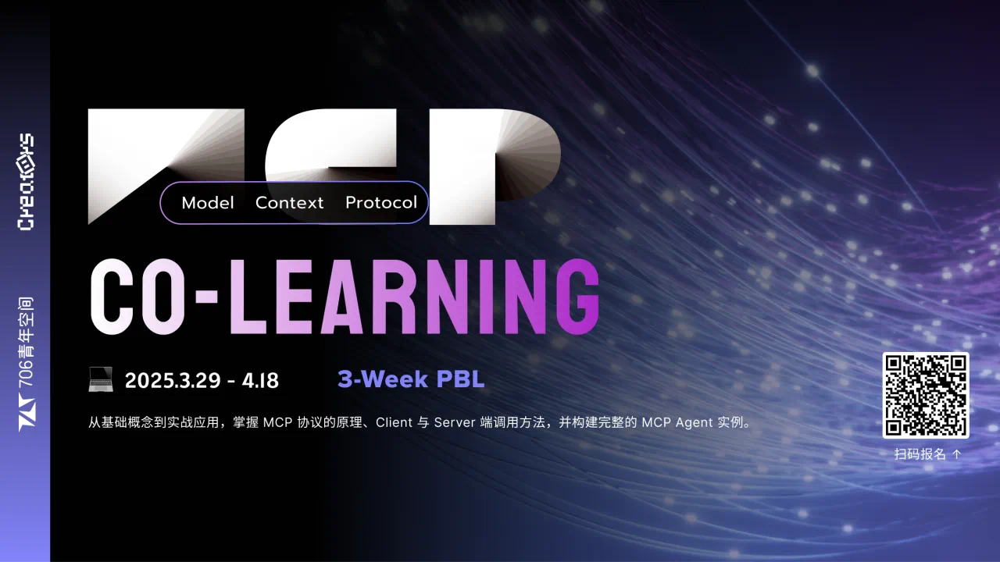

  <h1> 🚀 MCP 开发共学 🌟 </h1>
   

      学习目标：通过此次共学，学习MCP Agent 的运行架构、原理。了解如何构建兼容MCP协议的server、client，完成一个可以交互并解决自己实际问题的AI Agent。
   

   

    
    
    
  

## 📚 共学前置

参与这个共学需要知道

1. 💬 如何友好交流
2. 🐙 如何使用 github
3. 💻 Mac/Linux 开发环境
4. 🔧 至少具备一门编程语言基础 (Python、Javascript最佳)
   
## 🎯 共学模块

### 📅 week 1

1. W1-1：MCP 基本介绍 🌈

   🤖 AI Agent 开发的基本知识
   📋 MCP 协议的核心概念
   🎮 MCP 应用场景。

2. W1-2：Client 调用 🔌

   掌握在 Client 端调用 MCP 的原理和实现方法，理解数据交互的流程

   资料: [https://www.bilibili.com/video/BV1NRQxYXEuc](https://www.bilibili.com/video/BV1NRQxYXEuc)

### 📅 week 2

1. W2-1：Server 🖥️

   学习如何编写 MCP Server，使其能够与 Client 端进行有效的数据交互

2. W2-2：案例分析 🔍

   通过实际操作，构建一个完整的 MCP Agent 实例，提升对 MCP 协议的实战应用能力

资料: https://

## ✨ 共学产出

按照 [项目模版](https://github.com/orgs/706creators/discussions/60) 创建自己的 demo 项目，共学结束的时候参与 Demo day。

## ❓ 共学 QA

[discussions](https://github.com/orgs/706creators/discussions/categories/q-a)

## 🔗 Links

[https://modelcontextprotocol.io/](https://modelcontextprotocol.io/)

[sui ai agent learning](https://github.com/706creators/sui-ai-gent-learning)
